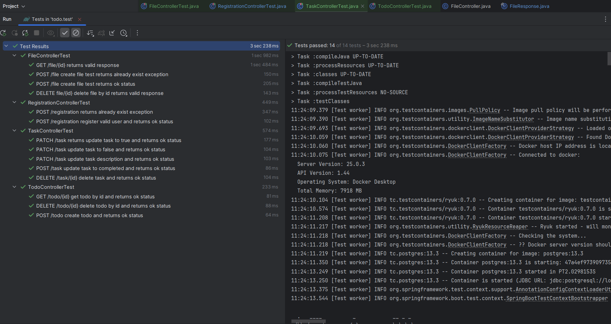

# TODO REST API
### Шаги для запуска проекта локально

1) ```git clone https://github.com/mesler1x/Todo-REST-API.git```

2) ```cd Todo-REST-API```

3) ```docker build -t todo-backend .```

4) ```docker compose up -d```

### Если не работает Docker

1) В файл /etc/docker/daemon.json вставить:
```
{
    "registry-mirrors": ["https://mirror.gcr.io", "https://daocloud.io", "https://c.163.com/", "https://registry.docker-cn.com"]
}
```
2) ```sudo systemctl restart docker```

### Описание стека
* TestContainers
* Spring DATA JPA
* Spring Boot
* Spring Security
* PostgreSql
* Docker

### Результаты интеграционных тестов


